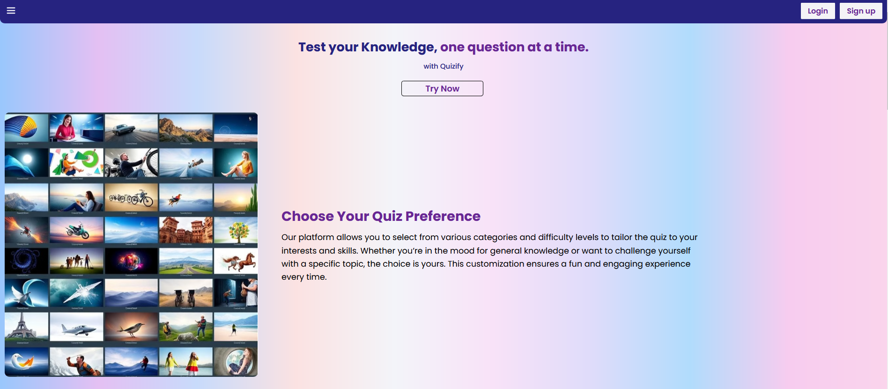
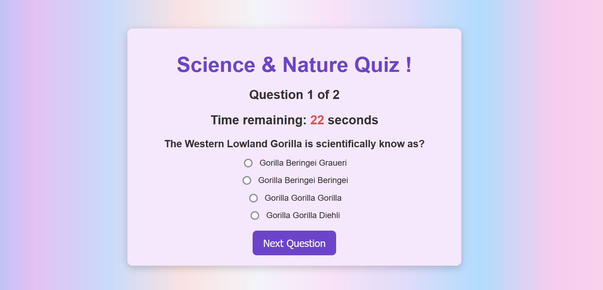

# Interactive Quiz Application

Welcome to the Interactive Quiz Application! 🎉 An engaging, customizable quiz platform built with Flask, HTML, CSS, and JavaScript. Users can select categories, difficulties, and the number of questions to test their knowledge while being timed on each question.

## Table of Contents
1. [Features](#features)
2. [Technology Stack](#technology-stack)
3. [Getting Started](#getting-started)
4. [Usage](#usage)
5. [Screenshots](#screenshots)
6. [Future Enhancements](#future-enhancements)
7. [License](#license)
8. [Contributing](#contributing)

## Features

- **User Authentication**: Secure login and registration system that saves your progress.
- **Customizable Quiz Settings**: Choose from various categories, difficulties, and question amounts.
- **Timer**: Race against the clock with a countdown timer for each question.
- **Scoring System**: Get feedback on your performance with scores displayed at the end of the quiz.
- **Responsive Design**: Enjoy the quiz on your device—desktop.
- **API Integration**: Questions are fetched dynamically from the [Open Trivia DB API](https://opentdb.com/).

## Technology Stack

- **Flask**: A lightweight and powerful Python web framework for building web applications.
- **SQLAlchemy**: ORM for interacting with the SQLite database to store user data and quiz results.
- **Flask-Login**: Handles user authentication and session management.
- **HTML/CSS**: Structure and style the front-end interface.
- **SQLite**: A lightweight relational database to store user details, quiz questions, and scores.
- **JavaScript**: Handles dynamic quiz features, including real-time countdowns and responsive multiple-choice questions.

## Project Breakdown

This project has been broken down into manageable tasks to ensure a smooth and organized development process:

1. **Initial Setup**: Setting up the project folder, Git, and dependencies.
2. **User Authentication**: Implementing the login and sign-up system for secure access.
3. **Database Design**: Structuring the database to store user information, and scores.
4. **Quiz Question Integration**: Fetching quiz questions dynamically via an external API.
5. **Timer Logic**: Implementing a countdown timer for each question.
6. **Scoring & Feedback**: Calculating and displaying the score at the end of the quiz.
7. **Responsive Design**: Ensuring the quiz app works seamlessly on all devices.
8. **Result Page**: A page where users can view their scores, feedback and review their answers.
9. **Testing & Debugging**: Ensuring all components work smoothly and fixing bugs.
10. **Documentation & Deployment**: Writing documentation and deploying the app for public use.

## Getting Started

### Prerequisites

1. **Python 3.x** - You need to have Python installed on your system.
2. **Flask** - The web framework used to build this app.
3. **SQLite** - Database engine to store user data and quiz results.
4. **Virtual environment** - A virtual environment manager like `venv` or `virtualenv`
5. **Dependies** - Dependencies listed in `requirements.txt`

### Installation

1. **Clone the repository**

   ```bash
   git clone https://github.com/ISSAM-SLI/Webstack_Portfolio_Project.git
   cd Webstack_Portfolio_Project
   ```

2. **Set up a virtual environment:**

   ```bash
   python3 -m venv venv
   source venv/bin/activate  # For Windows, use venv\Scripts\activate
   ```

3. **Install dependencies:**

   ```bash
   pip install -r requirements.txt
   ```

4. **Set up environment variables**
The app requires two environment variables to run:

**SECRET_KEY:** Used to secure the sessions and prevent tampering.

**DATABASE_URI:** The URI for connecting to your database.

You can set these environment variables in one of the following ways:

**Option 1:** Using **.env file** (recommended for development)

Create a .env file in the root of the project directory and add the following lines:
```
SECRET_KEY=your_secret_key_here
DATABASE_URI=your_database_uri_here
```
Make sure to replace **your_secret_key_here** with a random string (you can generate one using secrets.token_hex(16)) and **your_database_uri_here** with **the URI for your database**.Otherwise, The default **DATABASE_URI** is set to use an SQLite database **sqlite:///quizapp.db**

**Option 2:** Manually setting environment variables
You can manually set the environment variables in your terminal session before running the app. For example:

On Linux/macOS:
```
export SECRET_KEY=your_secret_key_here # For Windows, use set SECRET_KEY=your_secret_key_here
export DATABASE_URI=your_database_uri_here # For Windows, use set DATABASE_URI=your_database_uri_here
```

**Additional Notes:**

**Generating a secret key:** To generate a random secret key, you can use Python’s secrets module:

```
import secrets
print(secrets.token_hex(16))
```
**Database setup:** The default **DATABASE_URI** is set to use an SQLite database **(sqlite:///quizapp.db)**. If you need to use a different database, such as PostgreSQL or MySQL, you can update the **DATABASE_URI** in the .env file or set it as an environment variable accordingly.

5. Run the app:

   ```bash
   python3 run.py
   ```

   Visit `http://127.0.0.1:5000/` in your browser to start the quiz!

## Usage

- **Register**: Create an account to save your quiz progress.
- **Login**: Log in to access the quiz and track your scores.
- **Take the Quiz**: Answer the trivia questions, race against the timer, and see how well you perform.
- **View Results**: After completing the quiz, review your answers and score.

## Screenshots


*Home page of the app.*

 
*Quiz interface with timer and questions.*

## Future Enhancements

- Add more dynamic features like user leaderboards.
- Integrate with a larger trivia database for more diverse questions.
- Allow users to share quiz results on social media.

## License

This project is licensed under the MIT License - see the [LICENSE](LICENSE) file for details.

## Contributing

We welcome contributions to improve this project! Feel free to fork the repository, create a branch, and submit a pull request.

---

# Thank you for using the Interactive Quiz App! 🎉  
We hope it brings some fun and learning into your day. Happy quizzing! 🧠

### Key Features of this README:
- **Project Overview**: Briefly explains the purpose of the app and what it offers.
- **Technology Stack**: Lists the technologies used in building the app.
- **Installation Instructions**: A step-by-step guide for setting up the project locally.
- **Usage**: Describes how users can interact with the app.
- **Future Enhancements**: Mentions potential areas for improving the app.
- **License & Contribution**: Encourages open-source contributions and provides licensing information.
